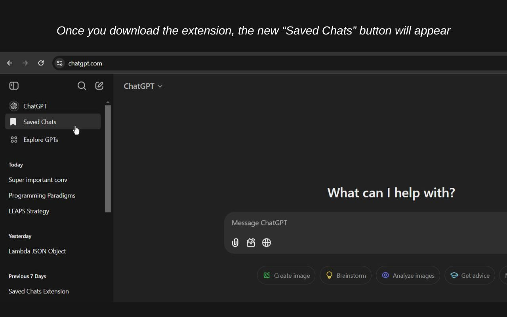
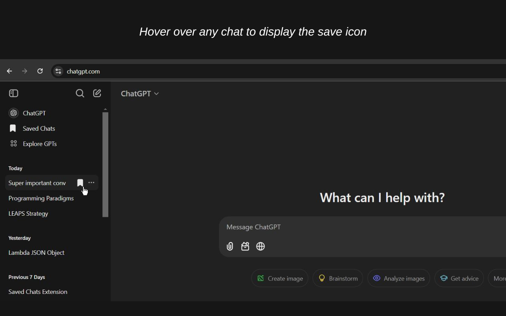
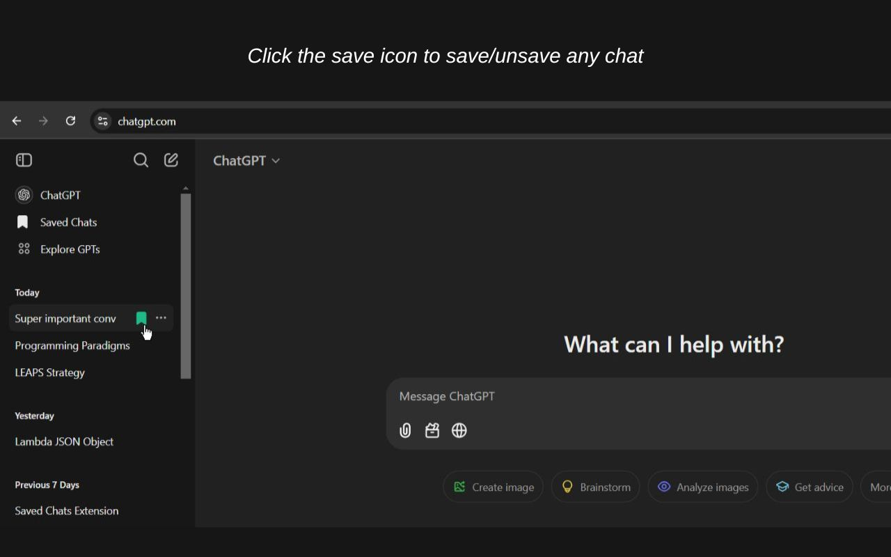
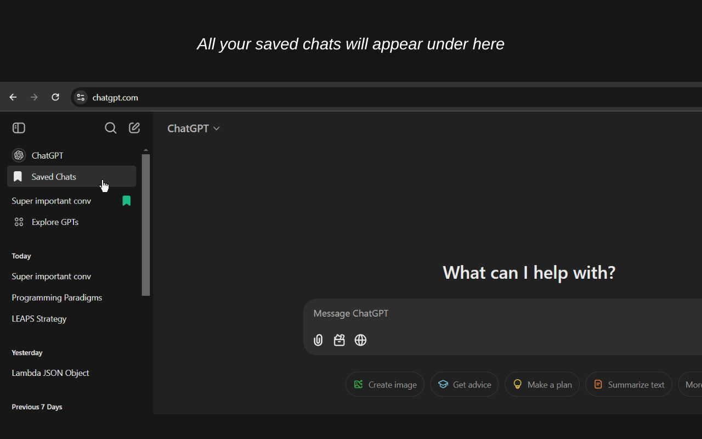

# ChatGPT Saved Chats

If you use ChatGPT a lot and are tired of losing important conversations in your endless chat history, then [ChatGPT Saved Chats](https://chromewebstore.google.com/detail/chatgpt-saved-chats/aonhnhcglgpnpopfghdplgcdkhchkkcg) is here to help!

This extension enables you to save and organize your most important conversations on ChatGPT in one place. Just hover over any chat and click the save icon to instantly save your favorite conversations. With ChatGPT Saved Chats, you can now quickly jump back into your favorite conversations without having to endlessly scroll through your chat history to find it.

## Key Features:

✅ One-click Save: Easily save and unsave any conversation with a single click. Just hover over any chat and click the save icon.

✅ User-friendly: Simple design and intuitive functionality for all users.

✅ Seamless Integration: Works perfectly within ChatGPT's interface without disrupting your workflow.

✅ Local Storage: Your saved chats are stored locally and never leave your browser.

Download ChatGPT Saved Chats now and start saving your favorite conversations today!

# How it works (high level)

1. A MutationObserver watches the page for the ChatGPT sidebar. When the sidebar is present, the extension injects:
   - A "Saved Chats" button (toggles the saved list).
   - A hidden saved-chats list where cloned chat items are added.
2. The script scans the sidebar chat items and appends a save icon to each. The icon is shown on hover.
3. Clicking a save icon:
   - Clones the chat item into the saved list.
   - Marks the icon as saved (green) and stores the cloned HTML in localStorage under a key derived from the chat's href.
4. Clicking the save icon in the saved list or clicking the icon again removes the saved item from the list and from localStorage, and resets the original sidebar icon back to the default state.
5. On startup the extension loads saved entries from localStorage and populates the Saved Chats list.

## Privacy Policy
**ChatGPT Saved Chats** does not collect, store, or transmit any personal data to external servers. All saved chats remain local to the user's browser storage and are not shared with the developer or any third party.
