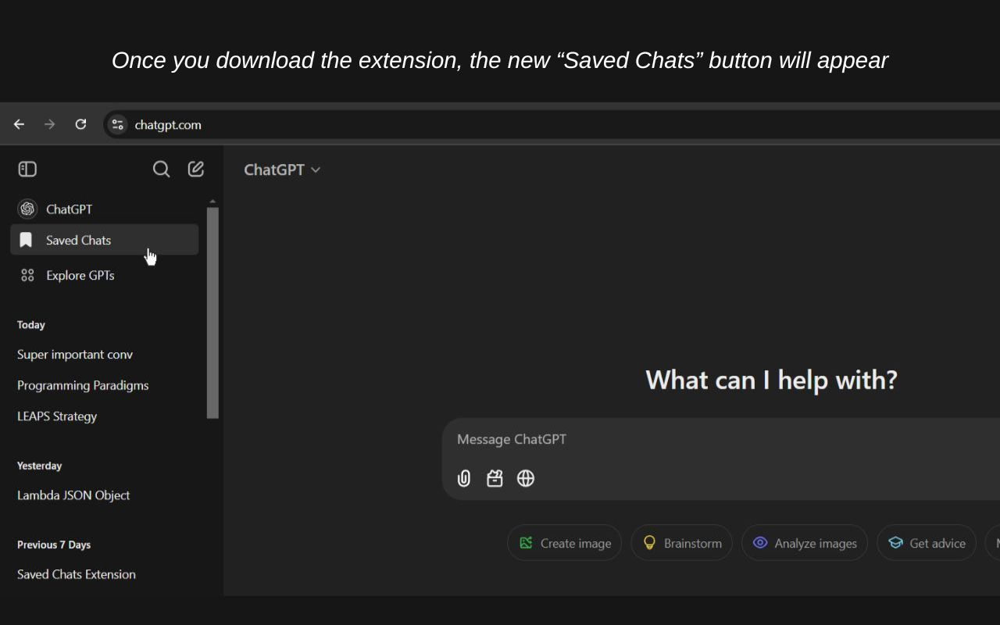
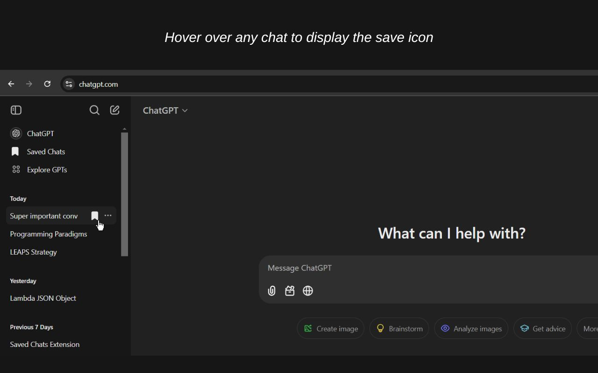
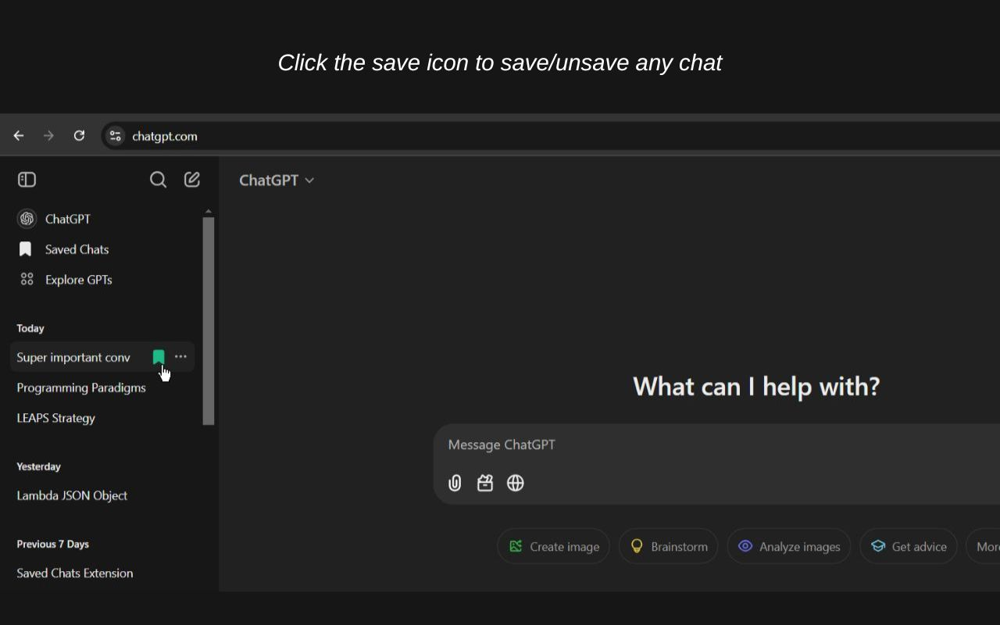
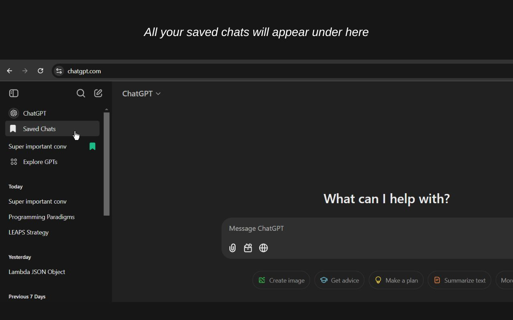

# ChatGPT Saved Chats

If you use ChatGPT a lot and are tired of losing important conversations in your endless chat history, then [ChatGPT Saved Chats](https://chromewebstore.google.com/detail/chatgpt-saved-chats/aonhnhcglgpnpopfghdplgcdkhchkkcg) is here to help!

This extension enables you to save and organize your most important conversations on ChatGPT in one place. Just hover over any chat and click the save icon to instantly save your favorite conversations. With ChatGPT Saved Chats, you can now quickly jump back into your favorite conversations without having to endlessly scroll through your chat history to find it.

## Key Features:

✅ One-click Save: Easily save and unsave any conversation with a single click. Just hover over any chat and click the save icon.

✅ User-friendly: Simple design and intuitive functionality for all users.

✅ Seamless Integration: Works perfectly within ChatGPT's interface without disrupting your workflow.

✅ Local Storage: Your saved chats are stored locally and never leave your browser.

Download ChatGPT Saved Chats now and start saving your favorite conversations today!

## Core Logic

The extension operates by injecting a script (`content.js`) into the ChatGPT interface. Here's how it works under the hood:

1.  **MutationObserver**: A `MutationObserver` is set up to watch for changes in the DOM. This is crucial because ChatGPT is a Single Page Application (SPA) where content is loaded dynamically. The observer waits for the sidebar to appear before injecting the "Saved Chats" button and list.
2.  **Chat Identification**: The script scans the sidebar for anchor tags (`<a>`) that link to specific chats (href starting with `/c/`). It appends a save icon to each of these items.
3.  **Cloning & Storage**: When a user clicks the save icon:
    -   The chat item's DOM element is cloned using `cloneNode(true)`.
    -   The cloned element is sanitized (e.g., removing active states) and added to the hidden "Saved Chats" list.
    -   The HTML of the cloned element is serialized and stored in the browser's `localStorage` using the chat's URL as the key.
4.  **Persistence**: On page load, the extension reads from `localStorage` and reconstructs the "Saved Chats" list, ensuring your saved conversations persist across sessions.

## Development

To make changes to the extension:

1.  Edit the files (e.g., `content.js`, `style.css`) in your favorite code editor.
2.  Go back to `chrome://extensions`.
3.  Find **ChatGPT Saved Chats** in the list.
4.  Click the **Reload** icon (circular arrow) on the extension card.
5.  Refresh the ChatGPT page to see your changes.

## Privacy Policy
**ChatGPT Saved Chats** does not collect, store, or transmit any personal data to external servers. All saved chats remain local to the user's browser storage and are not shared with the developer or any third party.
